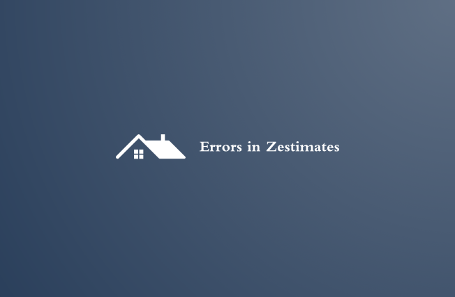

## Errors-in-Zestimates

### Project Summary

#### Project Objectives
> - Document code, process (data acquistion, preparation, exploratory data analysis and statistical testing, modeling, and model evaluation), findings, and key takeaways in a Jupyter Notebook report.
> - Create modules (wrangle.py, acquire.py, prepare.py, explore.py, evaluate.py) that make your process repeateable.
> - A report in the form of a final notebook.  The report should summarize your findings about the drivers of logerror.
> - Deliver a 4 minute final notebook presentation. This notebook will be what you present and should contain plenty of markdown documentation and cleaned up code.
> - Create a Trello board and [link](https://trello.com/b/I2qqcLxr/errors-in-zestimates) it in your READ.md
> - Answer panel questions about your code, process, findings and key takeaways, and model.

#### Business Goals
> - My goal is to find what features are drivers of error in the zestimate by incorporating clustering methodologies.
> - Use codeup zillow database and pull from the 2017 properties table where the latitude and longitude were not null.  Also only included the last transaction for each property.
> - Document the process.

#### Audience
> -  Data Science Team

#### Project Deliverables
> - A final report notebook 
> - A 4 min notebook presentation
> - All necessary modules to make my project reproducible

#### Project Context
> - The Zillow dataset I'm using came from the Codeup database.

#### Data Dictionary

| Feature               | Datatype                | Description                                          |
|:----------------------|:------------------------|:-----------------------------------------------------|
| bath                  | 28210 non-null: float64 | Number of bathrooms                                  |
| bed                   | 28210 non-null: float64 | Number of bedrooms                                   |
| area                  | 28210 non-null: float64 | Size of the home in sq ft                            |
| lat                   | 28210 non-null: float64 | latitude coordinate                                  |
| long                  | 28210 non-null: float64 | longitude coordinate                                 |
| lot_size              | 28210 non-null: float64 | Size of the entire property                          |
| year                  | 28210 non-null: float64 | year built                                           |
| tax_value             | 28210 non-null: float64 | Home Value                                           |
| tax_amount            | 28210 non-null: float64 | Home taxable amount                                  |
| logerror              | 28210 non-null: float64 | log error of actual vs predicted home price          |
| heating_type          | 28210 non-null: object  | Central, Floor/Wall, Yes, Forced air                 |
| county                | 28210 non-null: object  | Created this feature from fips.  LA, Orange, Ventura |
| price_per_sqft        | 28210 non-null: float64 | Created this feature lot_size/tax_value              |
| bath_scaled           | 28210 non-null: float64 | Number of bathrooms scaled                           |
| bed_scaled            | 28210 non-null: float64 | Number of bedrooms scaled                            |
| area_scaled           | 28210 non-null: float64 | Area of Home scaled                                  |
| lot_size_scaled       | 28210 non-null: float64 | Are of property scaled                               |
| year_scaled           | 28210 non-null: float64 | year built scaled                                    |
| tax_amount_scaled     | 28210 non-null: float64 | Home taxable amount scaled                           |
| tax_value_scaled      | 28210 non-null: float64 | Home value scaled                                    |
| lat_scaled            | 28210 non-null: float64 | Latitude coordinates scaled                          |
| long_scaled           | 28210 non-null: float64 | Longitude coordinates scaled                         |
| price_per_sqft_scaled | 28210 non-null: float64 | lot_size/tax_value scaled                            |
| cluster               | 28210 non-null: int32   | 0, 1, 2, 3, 4                                        |
| cluster_0             | 28210 non-null: uint8   | 0, 1                                                 |
| cluster_1             | 28210 non-null: uint8   | 0, 1                                                 |
| cluster_2             | 28210 non-null: uint8   | 0, 1                                                 |
| cluster_3             | 28210 non-null: uint8   | 0, 1                                                 |
| cluster_4             | 28210 non-null: uint8   | 0, 1                                                 |

#### Initial Hypotheses

> - Using clusters as features in my linear regression models will idenify which features are drivers of error in zestimate. 

#### **Hypothesis 1 -**
> - $H_{0}$: population means of the price per square feet for the three counties, Orange, Ventura & Los Angeles, are all equal.
> - $H_{a}$: population means of the price per square feet for the three counties, Orange, Ventura & Los Angeles, are NOT all equal. 
> - Outcome: I rejected the Null Hypothesis; Population means of the price per square feet for the three counties, Orange, Ventura & Los Angeles, are NOT all equal.

#### **Hypothesis 2 -** 

> - $H_0$ There is no difference in cluster0 logerror mean than the overall logerror mean
> - $H_a$ There is a difference in cluster0 logerror mean than the overall logerror mean
> - Outcome: I rejected the Null Hypothesis; There is a difference in cluster0 logerror mean than the overall logerror mean.
    

### Executive Summary - Conclusions & Next Steps

> - Conclusion, my OLS model did <b>not</b> beat my baseline RMSE by .0071.  The 5 clusters I found did not help identify drivers for logerror.  

> - Take Aways, looking back when my model did beat my baseline I realized that I made a few mistakes along the way.  First I didn't look at my clusters close enough.  If I did I would have realized that 4 clusters would have been better than 5.  Also, I only used 3 of the 5 clusters and accidently left out an entire county.  I spent more time making clusters, and not enough time exploring clusters.  Lastly, if I would plotted my residuals of my best validate model I could have seen there was a pattern which would have been a big red flag. 

> - If I had more time, I would go back and look into my clusters my closely and fix some of the mistakes I found after exploring the results of my test.

### Pipeline Stages Breakdown

##### Plan
> - Understand the project goals
    - What is my target?
    - What will I use my target for?
    - What are my deliverables?

> - Setup
    - Create a repo
    - Create a README.md
    - Update .gitignore
    - Create a draft and final in juypter notebook

> - Acquire the data from codeup database
    - Create an acquire.py module
    - Create a sql script
    - Setup acquire.py
    - Use python/sql to grab the data from codeup database
    - plot distributions
    - Run .head(), .info(), .describe()

> - Prepare
    - Create a prepare.py module
    - Clean data()
       - Drop columns
           - Document why I dropped columns
       - Handle nulls
           - Documnet which columns/rows will be dropped.
           - Impute? document how and why
       - Check datatypes
       - Check for duplicates
       - Rename columns
    - Remove outliers()
    - Split Data for modeling()
        - Encode()
            - Create dummies
            - Scale Data on Train
            - Transform Train, Validate, Test
    - Split Data for exploration()
        - No encoding
    
> - Explore
    - Ask and answer as many questions as i can
    - Create a Heatmap
    - Convert some continous values to categorical
    - Look at univariate graphs and bivariate graphs
    - Create initial hypothesis
    - Run some hypothesis testing
        - T-Test
        - Correlation
    - Feature Engineering
    - Clustering
        - Try out different features
            - Graph clusters
            - graph k using inertia

> - Model
    - Run as many linear regression models as i can.
        - Change out features
            - Document
        - Change out hyperparameters
            - Document
    - Select best model
         - Compare Validate and Train rmse and look for drop offs
         - plot residuals
    - Run test
    
> - Deliver
    - Create a data dictionary
    - Finish up final notebook
    - Finish up READ.me

##### Plan -> Acquire
> - Store functions that are needed to acquire data from the Zillow database on the Codeup data science database server; make sure the acquire.py module contains the necessary imports to run my code.
> - The final function will return a pandas DataFrame.
> - Import the acquire function from the acquire.py module
> - Complete some initial data summarization (`.info()`, `.describe()`, `.value_counts()`, ...).
> - Plot distributions of individual variables.
___

##### Plan -> Acquire -> Prepare
> - Store functions needed to prepare the zillow data; make sure the module contains the necessary imports to run the code. The final function should do the following:
    - Split the data into train/validate/test.
    - Handle any missing values.
    - Handle erroneous data and/or outliers that need addressing.
    - Encode variables as needed.
    - Create any new features, if made for this project.
> - Import the prepare function from the prepare.py module and use it to prepare the data in the Final Report Notebook.
___

##### Plan -> Acquire -> Prepare -> Explore
> - Answer key questions, my hypotheses, and figure out the features that can be used in a regression model to best predict the target variable, logerror. 
> - Run at least 2 statistical tests in data exploration. Document my hypotheses, set an alpha before running the tests, and document the findings well.
> - Create visualizations and run statistical tests that work toward discovering variable relationships (independent with independent and independent with dependent). The goal is to identify features that are correlated to tax_value (the target), identify any data integrity issues, and understand 'how the data works'. If there appears to be some sort of interaction or correlation, assume there is no causal relationship and brainstorm (and document) ideas on reasons there could be correlation.
> - Summarize my conclusions, provide clear answers to my specific questions, and summarize any takeaways/action plan from the work above.
___

##### Plan -> Acquire -> Prepare -> Explore -> Model
> - Establish a baseline accuracy to determine if having a model is better than no model and train and compare at least 3 different models. Document these steps well.
> - Train (fit, transform, evaluate) multiple models, varying the algorithm and/or hyperparameters you use.
> - Compare evaluation metrics across all the models you train and select the ones you want to evaluate using your validate dataframe.
> - Based on the evaluation of the models using the train and validate datasets, choose the best model to try with the test data, once.
> - Test the final model on the out-of-sample data (the testing dataset), summarize the performance, interpret and document the results.
___

##### Plan -> Acquire -> Prepare -> Explore -> Model -> Deliver
> - Introduce myself and my project goals at the very beginning of my notebook walkthrough.
> - Summarize my findings at the beginning like I would for an Executive Summary.
> - Walk "Data Science Team" through the analysis I did to answer my questions and that lead to my findings.
> - Clearly call out the questions and answers I am analyzing as well as offer insights and recommendations based on my findings.

### Reproduce My Project

You will need your own env file with database credentials along with all the necessary files listed below to run my final project notebook. 
- [x] Read this README.md
- [x] Download the wrangle.py, aquire.py, prepare.py, explore.py, evaluate.py, and final.ipynb files into your working directory
- [x] Add your own env file to your directory. (user, password, host)
- [x] Run the final_report.ipynb notebook